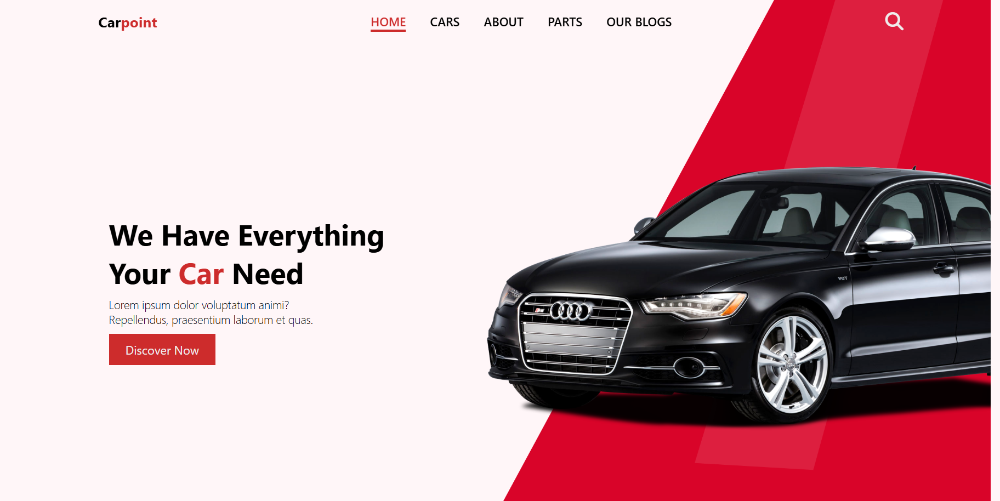

# Car Website

A fully responsive car dealership website named **CarPoint** offering car listings, spare parts, blogs, and detailed sections for better user engagement. Built using **HTML**, **CSS**, and JavaScript.

## Table of Contents
1. [Features](#features)
2. [Technologies Used](#technologies-used)
3. [File Structure](#file-structure)
4. [Setup Instructions](#setup-instructions)
5. [Project Preview](#project-preview)
6. [Credits](#credits)

## Features

- **Navigation Bar:** Includes a logo, menu items, and a search bar.
- **Home Section:** Catchy title and description with a call-to-action button.
- **Car Section:** Displays multiple car listings with images and titles.
- **About Section:** Information about the dealership and offerings.
- **Parts Section:** Showcases car spare parts with prices, ratings, and purchase buttons.
- **Blog Section:** Contains recent blog posts with images, titles, and descriptions.
- **Footer:** Provides links to social media, legal pages, and contact information.

## Technologies Used

- **HTML5**: Structure and content.
- **CSS3**: Styling and responsive design.
- **JavaScript**: Dynamic elements and interactions.
- **Font Awesome**: Icons for better UI design.

## File Structure

```
CarWebsite/
│
├── assets/
│   └── img/            # Images for cars, parts, and about section
│
├── style.css           # CSS file for styling
├── script.js           # JavaScript for interactivity
├── index.html          # Main HTML file
└── README.md           # Documentation file
```

## Setup Instructions

1. **Clone the Repository**:
   ```bash
   git clone https://github.com/Judinus10/carSaleWebsite
   ```

2. **Navigate to Project Folder**:
   ```bash
   cd carSaleWebsite
   ```

3. **Open in Browser**:
   Open the `index.html` file in any web browser.

4. **(Optional) Run on a Local Server**:
   - Install a simple HTTP server (e.g., `live-server` for VS Code).
   - Run the server and view the project.

## Project Preview




